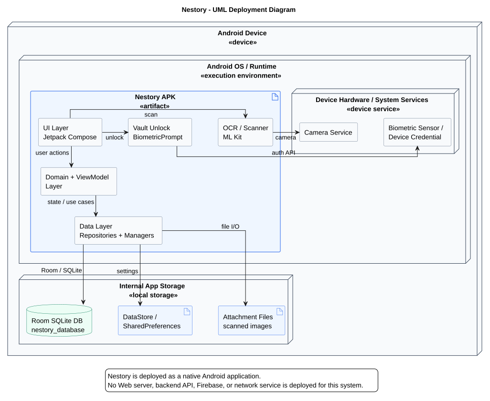

# Deployment Diagram - Nestory

## UML Deployment Diagram

PlantUML source: [`../diagrams/deployment-diagram.puml`](../diagrams/deployment-diagram.puml)

## Brief Node Description

**Android Device `<<device>>`**  
Thiet bi Android cua nguoi dung, la node trien khai chinh cua he thong. Toan bo ung dung Nestory chay truc tiep tren node nay, khong can Web server hay backend server rieng.

**Android OS / Runtime `<<execution environment>>`**  
Moi truong thuc thi Android cai va chay `Nestory APK`. Node nay chua runtime cua ung dung, Android API va cac system service ma app su dung.

**Nestory APK `<<artifact>>`**  
Goi ung dung duoc build tu project Android. Artifact nay chua UI Jetpack Compose, Domain/ViewModel layer, Data layer, OCR/scanner bang ML Kit va luong mo khoa vault bang BiometricPrompt.

**Internal App Storage `<<local storage>>`**  
Vung luu tru noi bo cua app tren thiet bi. Nestory dung node nay de luu du lieu offline, thiet lap, trang thai vault va file anh tai lieu da quet.

**Room SQLite DB `nestory_database`**  
Co so du lieu cuc bo duoc quan ly qua Room. Day la noi luu du lieu nghiep vu nhu document, category, kit va cac quan he du lieu lien quan.

**DataStore / SharedPreferences**  
Kho luu tru key-value cuc bo. DataStore dung cho cac thiet lap cua ung dung, con SharedPreferences dung cho trang thai khoi tao vault.

**Attachment Files**  
Tap hop file anh tai lieu da quet, duoc luu trong thu muc noi bo cua app.

**Device Hardware / System Services `<<device service>>`**  
Nhom dich vu he thong va phan cung ma ung dung goi thong qua Android API.

**Camera Service**  
Dich vu camera duoc ML Kit Document Scanner su dung de quet tai lieu va tao anh dau vao cho OCR.

**Biometric Sensor / Device Credential**  
Dich vu xac thuc sinh trac hoc hoac ma khoa thiet bi. Ung dung goi qua `BiometricPrompt` de mo khoa vault.

## Links

UI chuyen hanh dong nguoi dung sang Domain/ViewModel layer. Domain/ViewModel layer goi Data layer de xu ly state va use case. Data layer doc/ghi Room SQLite, DataStore/SharedPreferences va file noi bo. Khi quet tai lieu, UI goi ML Kit OCR/scanner, sau do ML Kit su dung Camera Service. Khi mo khoa vault, UI goi BiometricPrompt, sau do Android xac thuc bang Biometric Sensor hoac Device Credential.
